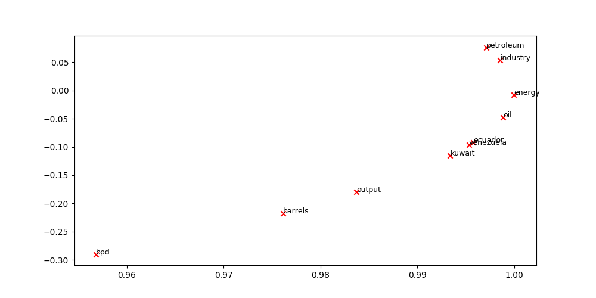

# NLP Assignments

Refer to individual folders for my implementations of the following papers. Credit to the [XCS224N team](https://online.stanford.edu/courses/xcs224n-natural-language-processing-deep-learning) for the starter codes and a great class!

## A1: Co-Occurence Embedding

Perform SVD on Co-Occurence Embedding matrix

## A2: Word2Vec

Word2Vec Skip-Gram Prediction Model

## A3: Dependency Parsing

Chen and Manning, 2014, https://nlp.stanford.edu/pubs/emnlp2014-depparser.pdf

## A4: Machine Translation using Recurrent Neural Network

Seq2Seq Model with Multiplicative Attention

## A5: Machine Translation with Convolutional Neural Network Character Encoding enhancements

Character-Aware Neural Language Models, Kim et al., 2016. https://arxiv.org/abs/1508.06615

Achieving Open Vocabulary Neural Machine Translation with Hybrid Word-Character Models, Luong and Manning, 2016. https://arxiv.org/abs/1604.00788

